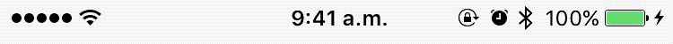

# Cordova Statusbar Notification
Based on CWStatusBarNotification [library](https://github.com/cezarywojcik/CWStatusBarNotification/)

Cordova Statusbar Notification for iOS

## Installation

`cordova plugin add https://github.com/jorgemejia/CordovaStatusBarNotification.git`

## Demo



## Usage
Tested on ionic 2 

```objc
declare var StatusBarNotification : any;

StatusBarNotification.showNotification('Network error connection');
```

## Sample usage
```objc
StatusBarNotification.showNotification('Network error connection');
```
## Options
```objc
var options = [{
    message:'Network error connection',
    large        : false,                //------> true, false
    duration     : 10,                   //------> Seconds to hide the notification   
    labelColor   : "blueColor",          //------> Based on UIColor: redColor, blackColor...  
    bgroundColor : "redColor",           //------> Based on UIColor: redColor, blackColor...  
    animationIn  : "top",                //------> available: top, bottom, left, rigth
    animationOut : "bottom"              //------> available: top, bottom, left, rigth
}]


StatusBarNotification.showNotification(options);
```


## License

    The MIT License (MIT)

    Copyright (c) 2017 Jorge Mejía <http://jorge182.webfactional.com/>

    Permission is hereby granted, free of charge, to any person obtaining a copy
    of this software and associated documentation files (the "Software"), to deal
    in the Software without restriction, including without limitation the rights
    to use, copy, modify, merge, publish, distribute, sublicense, and/or sell
    copies of the Software, and to permit persons to whom the Software is
    furnished to do so, subject to the following conditions:

    The above copyright notice and this permission notice shall be included in
    all copies or substantial portions of the Software.

    THE SOFTWARE IS PROVIDED "AS IS", WITHOUT WARRANTY OF ANY KIND, EXPRESS OR
    IMPLIED, INCLUDING BUT NOT LIMITED TO THE WARRANTIES OF MERCHANTABILITY,
    FITNESS FOR A PARTICULAR PURPOSE AND NONINFRINGEMENT. IN NO EVENT SHALL THE
    AUTHORS OR COPYRIGHT HOLDERS BE LIABLE FOR ANY CLAIM, DAMAGES OR OTHER
    LIABILITY, WHETHER IN AN ACTION OF CONTRACT, TORT OR OTHERWISE, ARISING FROM,
    OUT OF OR IN CONNECTION WITH THE SOFTWARE OR THE USE OR OTHER DEALINGS IN
    THE SOFTWARE.
